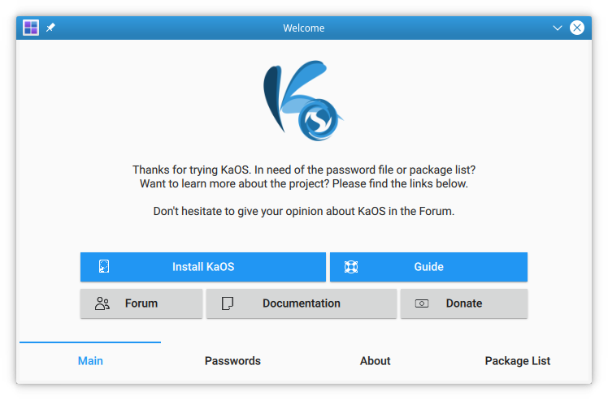

# welcome_qml
Live system welcome app for KaOS, written in QML




### License
GPL

### Dependencies

qt5-quickcontrols2, plasma-framework, qt5-webview


### Installation
Go to the source directory of the project and run:

```
/usr/lib/qt5/bin/qmake welcome.pro
make
make install
```

Make sure to adjust to the correct path of your Qt5 qmake. This will build and install Welcome, including localizations files.
